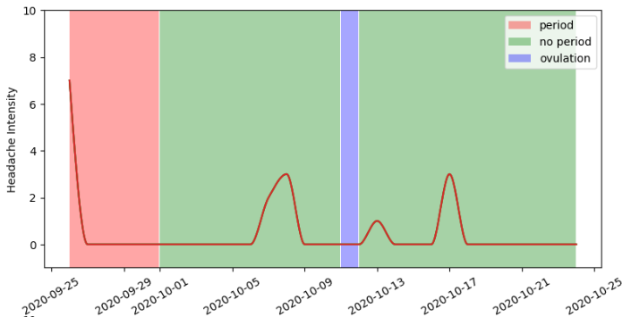

{
 "cells": [
  {
   "cell_type": "markdown",
   "metadata": {},
   "source": [
    "## Health Data Visualization\n",
    "\n",
    "### About the project\n",
    "In this project, I took two health journals of one patient and superimposed them in order to try and find any visual correlation. \\\n",
    "The first dataset is a migraine journal where the patient was logging days with and without headache, as well as the headache intentsity. \\\n",
    "The second dataset is a period journal, where the patient was logging their period and ovulation dates. \\\n",
    "Both journals span a period of 525 days.\n",
    "\n",
    "### Code\n",
    "This project contains a single notebook, divided into three parts:\n",
    "1. Loading the data - loading the .csv datasets and merging them into one.\n",
    "2. Preparing the data - creating functions that will process the data and convert it to the format needed for further visualization.\n",
    "3. Visualizing the data.\n",
    "\n",
    "### Results\n",
    "The resulting diagrams show the migraine dynamic over time as a plotline, while the periods are marked with color spans, with the timeline along the x axis and the headache intensity along the y axis. \n",
    "\n",
    ""
   ]
  }
 ],
 "metadata": {
  "language_info": {
   "name": "python"
  }
 },
 "nbformat": 4,
 "nbformat_minor": 2
}
